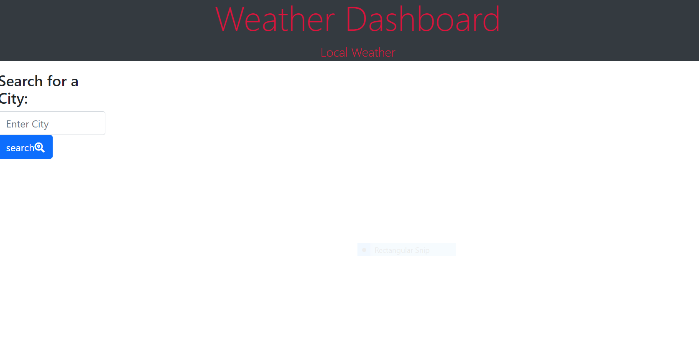
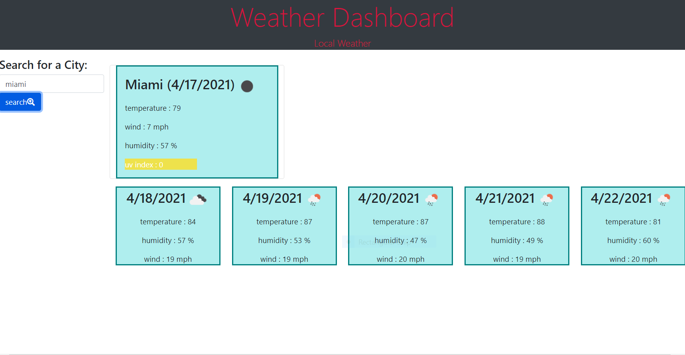

# Homework 06 Server-Side APIs: Weather Dashboard

## My Task

Use a Third-party API to retrieve data from OpenWeather One Call API to build a weather dashboard that will run in the browser and feature dynamically updated HTML and CSS.

## User Story

AS A traveler
I WANT to see the weather outlook for multiple cities
SO THAT I can plan a trip accordingly

## Description 

a user is presented a weather dashboard with form inputs, when a user types in a city they are presented with current and future conditions for that city and that city is added to the search history. When presented with the current weather conditions for that city the city name, the current data, the temperature, the humidity, the wind speed, and the uv index are listed along with a weather icon represetation of the weather conditions. When the uv index is presented a color also highlights the index indicating whether the conditions are favorable, moderate, or severe. When the user views future weather conditions for that city they are presented with a 5-day forecast that displays the dates, an icon representation of weather conditions, the temperature, the wind speed, and the humidity.
The user is also able to click on a city in the search history and again be presented with current and future conditions for that city. 

## Built With

*HTML
*CSS
*JAVASCRIPT
*JQUERY
*BOOTSTRAP
*OpenWeather One Call API

## Screenshots

## Deployment Links

* [GitHub Repository](https://github.com/efagioli01/Weather-Dashboard)
* [Deployed Application](https://efagioli01.github.io/Weather-Dashboard/)
